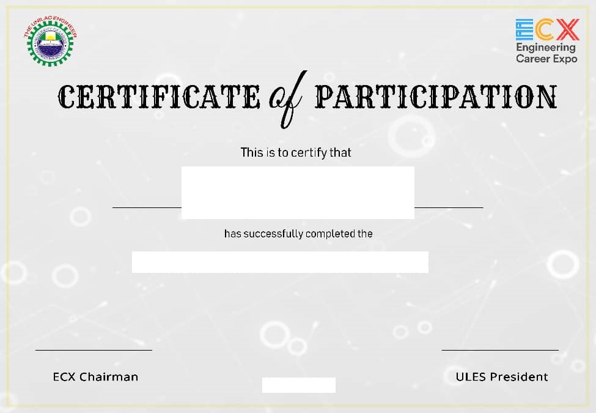

# Certificate Generator

Generates Certificates from a Given Image Template

Takes in a photograph of a certificate and some additional info then add the names to it.

Part of Problem Statement for Unilag DSC Open Hack Week 2019 **#OHW #OHW2019.**

## Requirements
* Python 3
* matplotlib

## Setting Up
1. Install the Requirements
    1. Install Python 3 on your system
    2. Install matplotlib on Python;
      ```bash
      $ pip3 install matplotlib
      ```
2. Run the `main.py` file
    1. Enter the CSV location
    2. Add additional info if available
    3. Enter the Image Template location
    4. Select the points on the image that should be replaced
    5. Exit the Image editor then check the certificates folder for the results.

## Current Progress
* [x] Reading and Parsing CSV files of names
* [x] Writing Text on the Certificates
* [x] Added Dynamic Templating Functionality

## TODO
* [ ] Make certificate more beautiful

## Author(s)
* LordGhostX
