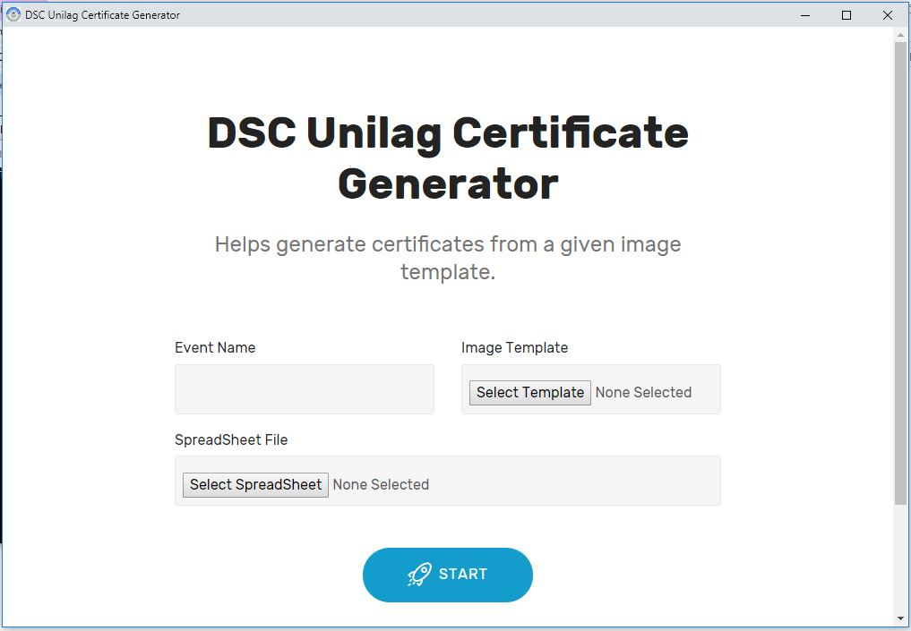

# Certificate Generator

Helps generate certificates from a given image template.

Takes in a photograph of a certificate and some additional info then add the names to it.

Part of the Problem Statements for Unilag DSC Open Hack Week 2019 **#OHW #OHW2019.**

This helps to solve the problem of manually having to write a certificate generator for each certificate that is going to be issued for an event or having a graphics manually design for each participant of the event. The project supports any spreadsheet format like csv, excel containing data to be included in the certificate. It also supports any kind of image file to be used as the certificate template.

UI made with [Mobirise](https://mobirise.com/)

## Requirements
* Python 3

Install the packages specified in `requirements.txt` file.

## Author(s)
* LordGhostX
